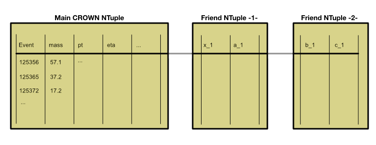

FriendTree Generation
===========================

CROWN can be used, to generate FriendTrees based on a CROWN ntuple. The concept of FriendTrees is explained here: https://root.cern/manual/trees/#widening-a-ttree-through-friends. They allow to extend an existing ntuple with new quantities. Common use cases are new high-level variables like neural network outputs or additional correction factors.

The the example depicted above, two additional friends to the main NTuple are created. During analysis, the quantities stored in the friend trees can be added by using the ``AddFriend`` method. The quantities are then available in the TTree as if they were part of the original NTuple.

A FriendTree is generated using a FriendTreeConfiguration. Such a configuration has some major differences, compared to a regular configuration:

1. The input file is a CROWN ntuple, not a ROOT file.
2. Only one scope per user is allowed.
3. No global scope is required
4. The available inputs have to be specified. The available inputs can be provided by using a CROWN ntuple as input, or a JSON file. The ntuple can be used for debugging proposes, when running a production, it is recommended to use a JSON file. The basic structure of this quantities map is listed below. Such a JSON can then be used for multiple eras, sample types and scopes.

.. code-block:: JSON

    {
        "era_1": {
            "sampletype_1": {
                "scope_1": {
                    "shift_1": [
                        "id_tau_vsJet_VLoose_2",
                        "id_tau_vsJet_VVLoose_2",
                        "jphi_1",
                        "q_2",
                        "id_wgt_tau_vsEle_VLoose_2",
                        "id_tau_vsEle_VTight_2",
                        "extramuon_veto",
                        "id_tau_vsJet_Tight_2",
                        "mass_1",
                        "puweight"
                    ],
                },
            },
        },
    }

The recommended way of producing FriendTrees is to use a workflow tool, that manages the submission of jobs, generation of tarballs and organizing the output. One possible workflow tool choice is KingMaker (https://github.com/KIT-CMS/KingMaker). A more detailed description of the KingMaker workflow can be found in :ref:`KingMaker`.

Writing a FriendTreeConfiguration
---------------------------------

The basic structure of a FriendTreeConfiguration is identical to a regular configuration. When creating a new FriendTree executable, an additional argument has to be provided:

* ``DQUANTITIESMAP`` - The path to the quantities map JSON file or the crown ntuple root file.

All other parameters are identical to the regular configuration. Setting up producers, outputs and new systematic shifts works the same way as before. The configuration has to be of type ``FriendTreeConfiguration``. During the configuration, the available inputs are checked for consistency, to catch any possible misconfiguration early. In addition, as for CROWN ntuples, only required shifts are executed.

FriendTrees with multiple input friend trees
--------------------------------------------

Starting from version 0.3 of CROWN, it is also possible to use multiple input friend trees. A typical use case for this feature is the evaluation of Classifiers, and storing the output of the classifier in the friend tree. This way, the classifier can utilize quantities from both the main ntuple and from additional friend trees. The interface for configuring such a FriendTree executable is similar to the regular FriendTree configuration, with the following differences:

* The information for all input files has to be provided. This means that the ``DQUANTITIESMAP`` has to be extended. It is possible to
    1. provide a single JSON file, that contains the input information for all input files (the crown ntuple + all additional files)
    2. provide a list of JSON files, each containing the input information for one input file
    3. provide a list of root files (crown ntuple + all additional files)

During the execution, all input files have to be provided, resulting in a command line like this:

.. code-block:: bash

    ./FriendTree_executalbe outputfile.root inputfile1.root inputfile2.root inputfile3.root

Before execution, the input files are checked for consistency. This means that the following checks are performed:

* All input files have to contain the same number of entries
* All input files have to be readable (no missing files)