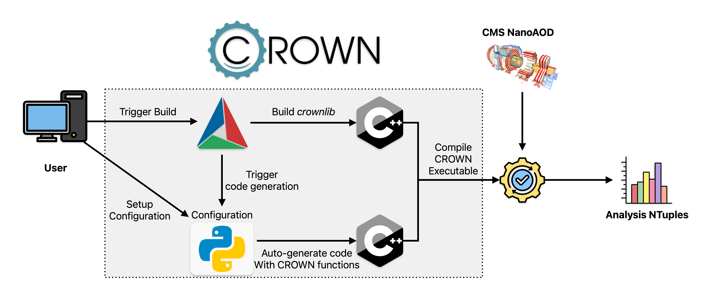

Introduction
=============

The **C** ++-based **RO** OT **W** orkflow for **N** -tuples (CROWN) is a fast new way to convert NanoAOD samples into flat :code:`TTrees` to be used in further analysis. The main focus of the framework is to provide a fast and clean way of selecting events and calculating quantities and weights. The framework has minimal dependencies and only uses ROOT and its Dataframe as a backend.

Design Idea
************

The framework consists of two main parts, a python configuration and a set of C++ functions. The python configuration is used to automatically generate a C++ script, which is then compiled to an executable using :code:`cmake` and all available compiler optimizations. This has the main advantage that the compiled executable is very fast and efficient in calculating the output `TTree`. In the following sketch, the overall workflow of CROWN is illustrated.

A more detailed presentation that presents the basics of the framework can be found in the following presentation: https://indico.cern.ch/event/1416180/

Getting started
****************

.. warning::
    The Framework depends on the scale factors provided by CMS. These are directly included in the repository via a git submodule. Since the scale factors are added from the CERN gitlab, access to the CERN gitlab repository (https://gitlab.cern.ch/cms-nanoAOD/jsonpog-integration), is needed. Since the repository is added via SSH, your SSH key must be added to the CERN gitlab instance ( A tutorial on how to do this can be found here: https://docs.gitlab.com/ee/user/ssh.html#add-an-ssh-key-to-your-gitlab-account).
    For the instructions to work, you also have to add the SSH key to your GitHub.com account. The instructions to do this can be found here: https://help.github.com/articles/adding-a-new-ssh-key-to-your-github-account/

After making sure, that the access rights are given, setting up the framework is straightforward.

First, clone the Repository

.. code-block:: console

   git clone --recurse-submodules git@github.com:KIT-CMS/CROWN.git

and source the current LCG stack

.. code-block:: console

   source init.sh

After this, the framework is installed, but without any analysis, other than the example analysis. If you want to set up a specific analysis, you can do so by adding the name of the analysis to your ``init.sh`` command. So e.g. to set up the `tau` Analysis, you can do so by running

.. code-block:: console

   source init.sh tau

The following list shows all currently available analyses that can be set up. If you want to include your own analysis, it needs to be added to the ``init.sh`` script. 

.. list-table:: Available Analyses Configurations for CROWN
   :widths: 25 150
   :header-rows: 1

   * - Analysis tag
     - Repository
   * - ``tau``
     - https://github.com/KIT-CMS/TauAnalysis-CROWN
   * - ``earlyrun3``
     - https://github.com/KIT-CMS/earlyRun3Analysis-CROWN
   * - ``whtautau``
     - https://github.com/KIT-CMS/WHTauTauAnalysis-CROWN
   * - ``boosted_h_tautau``
     - https://github.com/KIT-CMS/BoostedHiggsTauTauAnalysis-CROWN
   * - ``s``
     - https://github.com/nfaltermann/CROWNs

Running the framework
**********************

To create a new analysis executable, first create a build directory

.. code-block:: console

   mkdir build && cd build

and then run `cmake` to set up the Makefiles. A python configuration is needed to specify the code, that should be generated. Configurations are located in the :code:`analysis_configuations` directory. Within this folder, a subfolder for each installed type of analysis is present. Within the analysis folder, multiple Configurations belonging to the same analysis can be located. For example in the `tau` analysis, a main configuration `config.py` as well as several smaller Configurations exist.

.. Note::

   To be able to execute CROWN, you yourself have to provide the files and code for both \

   1. the analysis that you want to run e.g. `-DANALYSIS=template_analysis`
   2. the configuration that should be used `-DCONFIG=template_config`

For the cmake command, a minimal set of options has to be provided, in this case, we use the template analysis with the minimal example

.. code-block:: console

   cmake .. -DANALYSIS=template_analysis -DCONFIG=template_config -DSAMPLES=dyjets -DERAS=2018 -DSCOPES=mm

The options that are currently available are:

   * :code:`-DANALYSIS=template_analysis`: The analysis to be used. This is the name of the folder in the :code:`analysis_configurations` directory.
   * :code:`-DCONFIG=template_config`: The configuration to be used. This is the name of the python configuration file. The file has to be located in the directory of the analysis and the path is provided in the Python import syntax e.g. :code:`subfolder.myspecialconfig`
   * :code:`-DSAMPLES=dyjets`: The samples to be used. This is a single sample or a comma-separated list of sample names.
   * :code:`-DERAS=2018`: The era to be used. This is a single era or a comma-separated list of era names.
   * :code:`-DSCOPES=mt`: The scopes to be run. This is a single scope or a comma-separated list of scopes. The `global` scope is always run.
   * :code:`-DTHREADS=20`: The number of threads to be used. Default: :code:`1` (single threading).
   * :code:`-DSHIFTS=all`: The shifts to be used. If set to :code:`all`, all shifts are used, if set to :code:`none`, no shifts are used, so only nominal is produced. If set to a comma-separated list of shifts, only those shifts are used. If set to only a substring matching multiple shifts, all shifts matching that string will be produced e.g. :code:`-DSHIFTS=tauES` will produce all shifts containing :code:`tauES` in the name. Default: :code:`all`
   * :code:`-DDEBUG=true`: If set to true, the code generation will run with debug information and the executable will be compiled with debug flags. Default: :code:`false`
   * :code:`-DOPTIMIZED=true`: If set to true, the compiler will run with :code:`-O3`, resulting in slower build times but faster runtimes. Should be used for developments, but not in production. Default: :code:`true`

Compile the executable using

.. code-block:: console

   make install -j 8

The recommended build system is using regular UNIX build files, however, as an additional option, the ninja build system (https://ninja-build.org/) can be used for CROWN. To use ninja, set :code:`export CMAKE_GENERATOR="Ninja"` in the :code:`init.sh` as env variable, and then use the :code:`ninja install -j 8` command to compile the executable. Since CROWN profits from the parallelization of the build process, the number of threads can and should be set using the :code:`-j` option.

After the compilation, the CROWN executable can be found in the :code:`build/bin` folder. The executable can be used via a single output file followed by an arbitrary number of input files.

.. code-block:: console

   ./executable_name outputfile.root inputfile_1.root inputfile_2.root

Creating Documentation
***********************

The Web documentation at readthedocs is updated automatically. However, if you want to create the documentation locally you have to first create a new build directory like :code:`build_docs`

.. code-block:: console

   mkdir build_docs && cd build_docs

then run :code:`cmake` to set the documentation building process

.. code-block:: console

   cmake ../docs

and build the documentation using

.. code-block:: console

   make

The resulting documentation can then be found in

.. code-block:: console

   build_docs/docs/index.html

