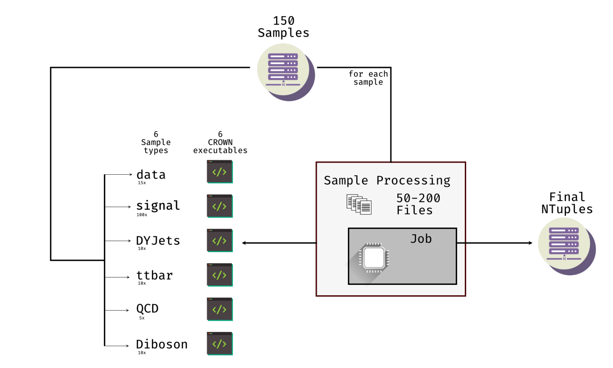

Workflow Management
====================

KingMaker is a workflow management for producing ntuples with the CROWN framework. The workflow management is based on law (https://github.com/riga/law), which uses luigi (https://github.com/spotify/luigi) as the backend. Kingmaker is used to orchestrate the production of ntuples and friend trees for the CROWN framework. The workflow is designed to be flexible and can be adapted to different analyses. Kingmaker takes care of building all required CROWN executables, submitting jobs to a batch system and writing the output to a remote storage. On top of that, Kingmaker can be used to generate FriendTrees, which can be used to store additional information to extend the ntuples. A sample manager is provided to manage the samples and keep track of the individual input files that have to be processed.



Setup
-----

.. code-block:: bash

    git clone git@github.com:KIT-CMS/KingMaker.git
    cd KingMaker
    source setup.sh

This should install all required packages and set up the environment. In addition, a ``luigid`` scheduler is started, if not already running. The required port is set to the ```LUIGIPORT``` environment variable.
The setup script has also additional options:

.. code-block:: bash
    
    Usage: source setup.sh [options]

    Options:
    -a, --analysis ANALYSIS    Specify the analysis workflow to use
                                [default: KingMaker]
    -c, --crown-analysis NAME  Specify CROWN analysis to check out (only with KingMaker workflow)
                                [default: plain CROWN]
                                Available analyses: https://crown.readthedocs.io/en/latest/introduction.html#id1
    -e, --env-path PATH       Specify custom environment path
                                [default: auto-detected]
    -l, --list                List available workflows
    -h, --help                Show this help message

Management of samples
---------------------

Samples can be managed manually or using the ``sample_manager``, which can be started with

.. code-block:: bash

    sample_manager

This starts a CLI, which can be used to add more samples to the database, update samples or quickly generate a sample list for producing ntuples.

Information on CMS datasets
~~~~~~~~~~~~~~~~~~~~~~~~~~~

To search for CMS datasets, we need first a bit of information, how these datasets can look like. We refer to the CMS dataset names as ``DAS nicks``, since we will search for them using the
Data Aggregation Service (DAS) of CMS. The datasets can be searched for at https://cmsweb.cern.ch/das/, or alternatively via ``dasgoclient`` (https://github.com/dmwm/dasgoclient) in a CMSSW
command-line environment. Our ``sample_manager`` integrates the corresponding software components and puts them into a questionnaire logic.

The naming convention of CMS datasets is according to https://twiki.cern.ch/twiki/bin/view/CMSPublic/WorkBookLocatingDataSamples as follows:

.. code-block:: bash

    # Convention:
    /PrimaryDataset/ProcessedDataset/DataTier
    # Examples:
    ## MC Simulation:
    /DYJetsToLL_M-50_TuneCP5_13TeV-madgraphMLM-pythia8/RunIISummer20UL16NanoAODv9-106X_mcRun2_asymptotic_v17-v1/NANOAODSIM
    ## Data:
    /Tau/Run2016B-ver2_HIPM_UL2016_MiniAODv2-v1/MINIAOD
    ## User-produced Dataset:
    /Tau/aakhmets-data_2016ULpreVFP_tau_Tau_Run2016B-ver2_HIPM_1736940678-00000000000000000000000000000000/USER

- ``PrimaryDataset`` usually represents the superset of data recorded by the experiment in case of Data, and the simulated process in case of MC simulation. In general, for User-produced Datasets this can be anything, however, it is the responsibility of the users to giving meaningful names so that other people can also use their Datasets.
- ``ProcessedDataset`` provides details on the actual production or processing campaigns of the dataset, including conditions (so-called ``GlobalTag``), version, etc. Again, user Datasets can state anything, but users are encouraged to set meaningful names.
- ``DataTier`` represents the dataformat of the dataset. A list of some more popular formats is given here: https://twiki.cern.ch/twiki/bin/view/CMSPublic/WorkBookDataFormats#EvenT. We are mostly interested in NANOAOD(SIM) and MINIAOD(SIM) which are tailored for analyses. The ``USER`` datatier represents anything that a user can produce.

All centrally produced datasets from CMS are stored under the ``prod/global`` DAS instance, while there is a dedicated DAS instance for user datasets, ``prod/phys03``.
See https://cmsweb.cern.ch/das/services for more details.

Addition of new Samples
~~~~~~~~~~~~~~~~~~~~~~~

When adding a new sample, follow the instructions of the ``sample_manager``. In the background, the DAS database of CMS is queried, to get samples, matching the provided dataset name:

.. code-block::

    Starting up Datasetmanager
    A working version of the database exists
    ? Load working version of database ? No
    Database loaded
    The database contains 581 samples, split over 4 era(s) and 22 sampletype(s)
    ? What do you want to do? Add a new sample
    ? Select the DAS instance for the search prod/global
    ? Enter a DAS nick to add /DYJetsToLL_M-50_*/RunIISummer20UL16NanoAOD*v9-106X*/NANOAODSIM
    Multiple results found
    ? Which dataset do you want to add ? (Use arrow keys to move, <space> to select, <a> to toggle, <i> to invert)
    » ○ Nick: /DYJetsToLL_M-50_TuneCH3_13TeV-madgraphMLM-herwig7/RunIISummer20UL16NanoAODAPVv9-106X_mcRun2_asymptotic_preVFP_v11-v1/NANOAODSIM - last changed: 03 Jan 2023 11:05 - created: 30 Nov 2022 14:26
    ○ Nick: /DYJetsToLL_M-50_TuneCH3_13TeV-madgraphMLM-herwig7/RunIISummer20UL16NanoAODv9-106X_mcRun2_asymptotic_v17-v1/NANOAODSIM - last changed: 08 Nov 2022 13:17 - created: 08 Nov 2022 05:15
    ○ Nick: /DYJetsToLL_M-500to700_TuneCP5_13TeV-amcatnloFXFX-pythia8/RunIISummer20UL16NanoAODv9-106X_mcRun2_asymptotic_v17-v2/NANOAODSIM - last changed: 05 Nov 2022 22:12 - created: 04 Nov 2022 00:52
    ○ Nick: /DYJetsToLL_M-500to700_TuneCP5_13TeV-amcatnloFXFX-pythia8/RunIISummer20UL16NanoAODAPVv9-106X_mcRun2_asymptotic_preVFP_v11-v1/NANOAODSIM - last changed: 15 Sep 2022 00:09 - created: 14 Sep 2022 22:32
    ○ Nick: /DYJetsToLL_M-50_Zpt-100to200_BPSFilter_TuneCP5_13TeV-madgraphMLM-pythia8/RunIISummer20UL16NanoAODAPVv9-106X_mcRun2_asymptotic_preVFP_v11-v1/NANOAODSIM - last changed: 05 May 2022 07:44 - created: 26 Apr 2022 06:
    ○ Nick: /DYJetsToLL_M-50_Zpt-100to200_BPSFilter_TuneCP5_13TeV-madgraphMLM-pythia8/RunIISummer20UL16NanoAODv9-106X_mcRun2_asymptotic_v17-v1/NANOAODSIM - last changed: 28 Mar 2022 21:51 - created: 28 Mar 2022 19:42
    ○ Nick: /DYJetsToLL_M-50_TuneCP5_13TeV-madgraphMLM-pythia8/RunIISummer20UL16NanoAODv9-106X_mcRun2_asymptotic_v17-v1/NANOAODSIM - last changed: 20 Feb 2022 06:54 - created: 17 Feb 2022 22:29
    ○ Nick: /DYJetsToLL_M-50_TuneCP5_13TeV-amcatnloFXFX-pythia8/RunIISummer20UL16NanoAODv9-106X_mcRun2_asymptotic_v17-v1/NANOAODSIM - last changed: 29 Nov 2021 11:10 - created: 28 Nov 2021 07:54

The results will be sorted by time, starting with the newest samples on top. The query name has to match the CMS conventions ``/*/*/*``. Select all samples that you want to add. Afterwards, set the correct sample type. Optionally, the ``sample_manager`` can calculate the GeneratorWeight associated to the sample. Since this process can take some time, the task can also be triggered afterwards.


Generation of sample lists
~~~~~~~~~~~~~~~~~~~~~~~~~~

To generate a sample list select ``Create a production file``

.. code-block::

    The database contains 581 samples, split over 4 era(s) and 22 sampletype(s)
    ? What do you want to do? (Use arrow keys)
        ○ Add a new sample
        ○ Edit a sample (not implemented yet)
        ○ Delete a sample
        ○ Find samples (by nick)
        ○ Find samples (by DAS name)
        ○ Print details of a sample
        » ○ Create a production file
        ○ Update genweight
        ○ Save and Exit
        ○ Exit without Save
        Answer: Create a production file


In the next step, select the eras you want to process using the arrow keys and space bar

.. code-block::

    Select eras to be added  (Use arrow keys to move, <space> to select, <a> to toggle, <i> to invert)
    ○ 2016postVFP
    ○ 2016preVFP
    ● 2018
    » ● 2017


and then select the sample types you want to process. The output file will be a ``.txt`` file, which can be used to produce ntuples.


Submission of ntuples
---------------------

In Kingmaker, three main tasks are present:

1. The production of ntuples
2. The production of friend trees
3. THe production of multiple friend trees (friend trees that depend on other friend trees)

The first task is handled by the ``ProduceSamples`` task, the second by the ``ProduceFriends`` task and the last by the ``ProduceMultiFriends`` task. In the case of friend trees, missing Ntuples or other friend trees are generated automatically.

.. warning::
    By default, KingMaker will write all outputs to the GridKA NRG storage. As a result, the user has to provide a valid X509 proxy, and the environment variable ``X509_USER_PROXY`` has to be set. The proxy can be created using ``voms-proxy-init``. The proxy has to be valid for at least 24 hours. The proxy can be checked using ``voms-proxy-info``.
    To use a different output storage, the KingMaker configuration has to be adapted, more details can be found in the :ref:`KingMaker Configuration` section.

Production of NTuples
~~~~~~~~~~~~~~~~~~~~~

To trigger a production of ntuples run

.. code-block:: bash

    law run ProduceSamples --analysis template_analysis --config template_config --production-tag test_production_v1 --sample-list samples.txt --scopes mm --shifts None --workers 8 


The different options are:

- ``--analysis``: The analysis to be used. The name corresponds to the analysis folder in the ``CROWN/analysis_configurations`` folder.
- ``--config``: The config file to be used. The config file contains the information about all producers, parameters and output branches that are needed to run the ntuple production of your analysis. The config file is located in the ``CROWN/analysis_configurations/<analysis>/`` folder.
- ``--production-tag``: The production tag is used to identify the production. It is used to create the output folder and the output files. The output files are stored in the ``/<base>/<production-tag>/CROWNRun/`` folder. The ``base`` variable is set using the Configuration. By default, it is set to ``root://cmsxrootd-kit-disk.gridka.de//store/user/${USER}/CROWN/ntuples/``. Within the ``CROWNRun`` folder, the different samples are stored, matching the ``<era>/<samplenick>/<channel>/<samplenick>_<counter>.root`` pattern.
- ``--sample-list``: The sample list to be used. The sample list can be generated by the ``sample_manager`` and contains the information about the samples to be processed. The sample nicks can also be provided as a comma-separated list.
- ``--scopes``: The scopes to be used, provided as a comma-separated list.
- ``--shifts``: The shifts to be used, provided as a comma-separated list. If this parameter is not set, no shifts are applied. If ``All`` is provided, all shifts are applied, if ``None`` is provided, no shifts are applied.
- ``--workers``: The number of workers to be used. Each worker is responsible for the submission and handling of one sample. The number of workers should be at least the number of samples. If it is lower only the given number of samples will be processed at the same time and the additional samples will only be submitted when one of the already submitted samples is finished.

.. warning::
    The law processes can get stuck after building the tarball when trying to upload it to the dCache when using more than 1 worker. The task will be stuck indefinitely. To avoid this, the user must cancel the running law command using ``Ctrl+C``. Afterwards, the task can be restarted using the same command. The task will then continue with the upload of the tarball. The reason for this behaviour is unknown.


Additionally, the following options can be useful:

- ``--print-status -1``: Print the status of the tasks. If ``-1`` is provided, the status of every task is printed.
- ``--remove-output -1``: Remove the output files. This option is useful if the production fails and the output files should be removed. This will trigger an interactive CLI, where only parts of the production can be removed as well.
- ``--CROWNRun-workflow local``: This option can be used to run the production locally. This is useful for debugging purposes if the batch system is currently not available. However, be aware, that this option should only run with a limited amount of workers and samples since it is very easy to overload the local machine.

.. warning::
    When using the dCache as Ntuple storage, the remove option should be used with care. Since the dCache caches files without checking, if the file content changes, overwriting files can lead to errors, where the old file is still cached. The saver option is to remove the old files and store the new files using a separate ``production-tag``.


Production of friend trees
~~~~~~~~~~~~~~~~~~~~~~~~~~

For the production of friend trees, the same options as for the production of ntuples are available. An example command is given below:

.. code-block:: bash

    law run ProduceFriends --analysis template_analysis --config template_config --production-tag test_production_v1 --friend-config template_friend_config --friend-name test_friend_v1 --sample-list samples.txt --scopes mm --shifts None --workers 8

Some additional options are required:

- ``--friend-config``: The friend config file to be used. The friend config file contains the information about the friend trees to be produced like the producers to be run and the output branches that should be saved to the friend trees. The friend config file is located in the ``CROWN/analysis_configurations/<analysis>/tau_friends`` folder.
- ``--friend-name``: The name or tag of the friend tree to be produced. The name can be different from the friend config file name and can be seen as a tag for a friend tree production. The resulting friend trees will be stored in the ``/<base>/<production-tag>/CROWNFriends/<friend-name>/`` folder.

The resulting folder structure for the command listed above will be

.. code-block::

    /<base>/<production-tag>/
        |- CROWNRun/
                        |- <era>/<samplenick>/<channel>/<samplenick>_<counter>.root
        |- CROWNFriends/
                        |- test_friend_v1/<era>/<samplenick>/<channel>/<samplenick>_<counter>.root

To perform the generation of friend trees locally, use

- ``--CROWNFriends-workflow local --CROWNRun-workflow local``: This option can be used to run the production locally. This is useful for debugging purposes if the batch system is currently not available. However, be aware, that this option should only run with a limited amount of workers and samples since it is very easy to overload the local machine.


Production of friend trees with additional friends as input
~~~~~~~~~~~~~~~~~~~~~~~~~~~~~~~~~~~~~~~~~~~~~~~~~~~~~~~~~~~

If the requested friend tree depends on additional friend trees the ``ProduceMultiFriends`` workflow is used for the final friend tree. The command

.. code-block:: bash

    law run ProduceMultiFriends --analysis template_analysis --config template_config --production-tag test_production_v1 --friend-config template_multifriend_config --friend-name test_multifriend_v1 --friend-dependencies template_friend_config --friend-mapping '{"template_friend_config":"test_friend_v1"}' --sample-list samples.txt --scopes mm --shifts None --workers 8

contains additional options

- ``--friend-dependencies``: A list of additional friend configurations to be run because their outputs are needed for ``--friend-config template_multifriend_config``. The list has to be provided as a comma-separated list. If these friend trees are already produced, their production will be skipped. To set the name for the intermediate friend trees, two options are available. By default, the name of the configuration will be used as the name of the friend tree. The resulting friend trees will be stored in the ``/<base>/<production-tag>/CROWNFriends/<friend-config>/`` folder. Alternatively, the parameter ``friend_mapping`` can be used, to define a dictionary, where a mapping between the friend config name and the friend tree name can be defined. The dictionary has to be provided as a JSON string. An example is given below:

.. code-block:: python

    --friend-mapping '{"template_friend_config":"test_friend_v1"}'

As an example, the command listed above will produce not only ntuples for all samples specified in ``samples.txt`` using the config but also the friend tree ``template_friend_config``. All those three inputs will then be used, to produce the final friend tree ``template_multifriend_config``. The resulting folder structure will be

.. code-block::

    /<base>/<production-tag>/
        |- CROWNRun/
                        |- <era>/<samplenick>/<channel>/<samplenick>_<counter>.root
        |- CROWNFriends/
                        |- template_friend_config/<era>/<samplenick>/<channel>/<samplenick>_<counter>.root      (name automatically generated)
        |- CROWNMultiFriends/
                        |- test_multifriend_v1/<era>/<samplenick>/<channel>/<samplenick>_<counter>.root

if no ``friend_mapping`` is used, or

.. code-block::

    /<base>/<production-tag>/
        |- CROWNRun/
                        |- <era>/<samplenick>/<channel>/<samplenick>_<counter>.root
        |- CROWNFriends/
                        |- test_friend_v1/<era>/<samplenick>/<channel>/<samplenick>_<counter>.root
        |- CROWNMultiFriends/
                        |- test_multifriend_v1/<era>/<samplenick>/<channel>/<samplenick>_<counter>.root

with the exmaple ``friend_mapping`` mentioned above.


KingMaker Configuration
-----------------------

The two relevant configuration files can be found in the ``lawluigi_configs`` folder. They are called ``KingMaker_law.cfg`` and ``KingMaker_luigi.cfg``.

.. warning::
    Most default parameters in the Configuration are chosen such that only minimal changes are required. Nevertheless, the user should check the configuration files before running KingMaker.

In the ``KingMaker_law.cfg`` file, the different tasks are defined. Also, the remote filesystem is defined here:

.. code-block::

    [wlcg_fs]
    base: root://cmsxrootd-kit-disk.gridka.de//store/user/${USER}/CROWN/ntuples/
    use_cache: True
    cache_root: /tmp/${USER}/
    cache_max_size: 20000

In general, it is good practice to use the ``use_cache`` option. This will cache the files locally, which can speed up the processing. The ``cache_max_size`` option defines the maximum size of the cache in MB. If the cache is full, the oldest files are removed from the cache.

The ``base`` option defines the base path of the remote filesystem. The ``${USER}`` variable is replaced by the username. The ``base`` path is used to define the output path of the ntuples and friend trees. The ``base`` path is also used to define the input path of the friend trees. The ``base`` path should be set to the path of the dCache storage.

The ``KingMaker_luigi.cfg`` file contains the configuration of the different tasks. The most important options are defined in the ``[DEFAULT]`` section and include setting for the HTCondor job submission. Parameters defined in the ``[DEFAULT]`` section can be overwritten in the task-specific sections.

.. code-block::

    name = KingMaker
    ENV_NAME = KingMaker
    wlcg_path = root://cmsxrootd-kit-disk.gridka.de//store/user/${USER}/CROWN/ntuples/
    htcondor_accounting_group = cms.higgs
    htcondor_remote_job = True
    htcondor_universe = docker
    transfer_logs = True
    local_scheduler = True
    tolerance = 0.00
    acceptance = 1.00
    ; submit only missing htcondor workflow branches (should always be true)
    only_missing = True

    ; bootstrap file to be sourced at beginning of htcondor jobs (relative PATH to framework.py)
    bootstrap_file = setup_law_remote.sh
    files_per_task = 10
    ; scopes and shifts are to be provided in the config, or as command line arguments via --scope and --shift
    ; in both cases, the values are expected to be comma-separated lists without spaces or quotes
    scopes = mt,et
    shifts = None

Here, the ``wlcg_path`` option should be set to the same path, as the ``base`` path in the ``KingMaker_law.cfg``. The different ``htcondor_`` parameters have to be adopted according to the requirements of the batch system. For the different tasks, that are run remotely, different job requirements can be set. The ``files_per_task`` option defines the number of files to be processed per task. The ``scopes`` and ``shifts`` options define the scopes and shifts to be used. These two parameters can also be provided as command line arguments, which is the recommended way. Here ``CROWNRun`` and ``CROWNFriends`` as an example:

.. code-block::

    [CROWNRun]
    ; HTCondor
    htcondor_walltime = 10800
    htcondor_request_memory = 16000
    htcondor_request_disk = 20000000
    htcondor_request_cpus = 4
    # for these eras, only one file per task is processed
    problematic_eras = ["2018B", "2017C", "2016B-ver2"]

    [CROWNFriends]
    ; HTCondor
    htcondor_walltime = 10800
    htcondor_request_memory = 16000
    htcondor_request_disk = 20000000
    # friends have to be run in single core mode to ensure a correct order of the tree entries
    htcondor_request_cpus = 1

The ``problematic_eras`` option is used to define eras, where only one file per task is processed. This can be required, if the NanoAOD input files have a change in their structure, e.g. if trigger paths are modified. To avoid problems in these cases, jobs can be processed with only one input file. This will slow down the processing but ensures that the processing is not stopped by a single file. Disk, wall time and other requirements can be set in the task-specific sections.

.. warning::
    For friend trees, multiprocessing is not possible, since the resulting friend tree must have the same order as the input tree. Therefore, the ``htcondor_request_cpus`` option has to be set to 1, which will disable multiprocessing.

For a more complete description of the different options, please refer to the overcomplete configuration in the law repository (https://github.com/riga/law/blob/master/law.cfg.example).
