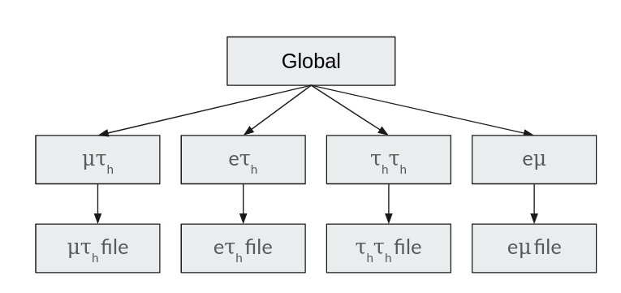

Writing a CROWN Configuration
==============================

The most important part of CROWN is the configuration file. In this file, all producers, cuts, shifts and output variables are defined. The configuration is contained in a configuration class. In the following, a simple example and the provided functions are given. A configuration has to include

1. Producers to be run
2. Parameters to be used by the producers
3. Output variables to be used

Additionally, it can include

1. Modifiers: Modifiers can be used to change parameters based on era or sample.
2. Rules: A modification rule can be used to add/remove producers based on era or sample.
3. Systematics: Systematics can be used to vary the parameters of the producers and add the varied output to the output file as well.

One advantage of CROWN is that several final states can be produced at the same time. First, the **global** scope is run, which includes all operations that are independent of the analysis's final state and are identical for all final states. Then, the processing is split into several **scopes**, which are run in parallel. Each **scope** results in a separate output file in the end. All parameters, outputs, producers, modifiers and systematics are always defined, depending on the scope. The global scope can be treated as a normal scope, but **it is always run first**, and all other scopes inherit the parameters, producers, modifiers and systematics of the global scope.

Basics
*******

The configuration file should be contained in the config folder. During the build process, the user can specify the configuration file to be used by setting

.. code-block:: console

   -DANALYSIS=analysisname

where the ``analysisname`` is the name of the configuration file. Files in different folders can be specified using the Python import syntax e.g. ``-DANALYSIS=config.analysis.signal``. The basic required structure of the configuration file is as follows:

.. code-block:: python

    def build_config(
        era,
        sample,
        scopes,
        shifts,
        available_sample_types,
        available_eras,
        available_scopes,
    ):

        configuration = Configuration(
                era,
                sample,
                scopes,
                shifts,
                available_sample_types,
                available_eras,
                available_scopes,
            )
        #########################
        # setup the configuration
        #########################

        ...

        #########################
        # Finalize and validate the configuration
        #########################
        configuration.optimize()
        configuration.validate()
        configuration.report()
        return configuration.dump_dict()

The configuration class provides several functions to set up a configuration conveniently. These functions will be explained in the following.

Parameters
***********

Parameters are added using the :py:func:`~code_generation.configuration.Configuration.add_config_parameters` function. A basic example usage of the function is

.. code-block:: python

    # add muon selection cuts
    configuration.add_config_parameters(
        ["mm", "mt'],
        {
            "muon_iso_cut": 0.3,
            "min_muon_pt": 23.0,
            "max_muon_eta": 2.4,
            "muon_id": "Muon_mediumId",
        },
    )

This adds the parameters ``muon_iso_cut``, ``min_muon_pt``, ``max_muon_eta`` and ``muon_id`` to the parameter list of the producers ``mm`` and ``mt``. These parameters can be used by any producer in the ``mm`` and ``mt`` scope and will be set to the given values. So e.g. in the :py:obj:`~code_generation.producers.muons.GoodMuonPtCut` producer

.. code-block:: python

    GoodMuonPtCut = Producer(
        name="GoodMuonPtCut",
        call="physicsobject::CutPt({df}, {input}, {output}, {min_muon_pt})",
        input=[nanoAOD.Muon_pt],
        output=[],
        scopes=["em", "mt", "mm"],
    )

the parameter ``min_muon_pt`` will be set to 23.0.

Configuration Modifiers
************************

Modifiers can be used, to conveniently change parameters of the configuration based on the era and the sample. Two main methods are available

1. :py:class:`~code_generation.modifiers.SampleModifier` - Modifies the parameters of producers based on the sample.
2. :py:class:`~code_generation.modifiers.EraModifier` - Modifies the parameters of producers based on the era.

Both have a similar interface. The basic structure of how to include a modifier is

.. code-block:: python

    configuration.add_config_parameters(
        ["mm", "mt'],
        {
            "applyRecoilCorrections":
                SampleModifier({"wj": True}, default=False),
        },
    )

In this example, the parameter ``applyRecoilCorrections`` is added to the parameter list of the producers ``mm`` and ``mt``. Due to the configuration of the modifier, the parameter will be set to ``True`` for the samples of the type ``wj``. For all other samples, the default value ``False`` is set.

Internally, the resolving of modifiers is done using the :py:func:`~code_generation.configuration.Configuration.resolve_modifiers` function, which is called automatically by the :py:func:`~code_generation.configuration.Configuration.add_config_parameters` function.

Output Quantities
******************

All output quantities will be included in the output ntuple ROOT file. The output quantities are defined using the :py:func:`~code_generation.configuration.Configuration.add_outputs` function. The basic structure is

.. code-block:: python

    configuration.add_outputs(
        ["mm", "mt"],
        [
            nanoAOD.event,
            q.pt_1,
            q.pt_2,
            q.m_vis,
        ],
    )

This example adds the output quantities ``event``, ``pt_1``, ``pt_2`` and ``m_vis`` to the output of the producers ``mm`` and ``mt``. There are two types of quantities available:

1. :py:class:`~code_generation.quantity.Quantity` - A quantity produced by a CROWN producer
2. :py:class:`~code_generation.quantity.NanoAODQuantity` - A quantity from the input nanoAOD file

Both types can be used as output quantities. A :py:class:`~code_generation.quantity.Quantity` has to be defined in the :py:obj:`code_generation.quantities.output` file and a :py:class:`~code_generation.quantity.NanoAODQuantity` is defined in the :py:obj:`code_generation.quantities.nanoAOD` file.

Set of Producers
*****************

The set of producers to be run can be defined using the :py:func:`~code_generation.configuration.Configuration.add_producers` function. The basic structure is

.. code-block:: python

    configuration.add_producers(
        "mm",
        [
            muons.GoodMuons,
            muons.VetoMuons,
            pairselection.MMPairSelection,
            pairselection.GoodMMPairFilter,
        ]
    )

In this example, the producers ``GoodMuons``, ``VetoMuons``, ``MMPairSelection`` and ``GoodMMPairFilter`` are added to the list of producers ``mm``. The producers added here can be both a :py:class:`~code_generation.producer.Producer` or a :py:class:`~code_generation.producers.ProducerGroup`. Also, the order of the producers is not important. Using the :py:func:`~code_generation.configuration.Configuration.optimize` function, the producers' ordering will be optimized, such that filters are always run first, and that producers that depend on other producers are run after the producers that they depend on.

The collection of available producers can be found in the :py:mod:`code_generation.producers` folder. An explanation of how producers are set up and linked to their corresponding C++ function is given in :ref:`Defining a new python Producer`.

Systematic Variations
**********************

Systematic Variations are an important part of physics analysis. CROWN provides a powerful way to set up systematic variations. The basic structure of including a systematic variation to the configuration is the :py:func:`~code_generation.configuration.Configuration.add_shift` function. The basic structure is

.. code-block:: python

    configuration.add_shift(
        SystematicShift(
            name="tauES_1prong0pizeroDown",
            shift_config={"global": {"tau_ES_shift_DM0": 0.998}},
            producers={"global": taus.TauPtCorrection},
            ignore_producers={"mt": [pairselection.LVMu1, muons.VetoMuons]},
        )
    )

In this example, a new :py:class:`~code_generation.systematics.SystematicShift` object is added to the configuration. The ``name`` of the shift is ``tauES_1prong0pizeroDown``. The ``shift_config`` contains a dictionary of configuration parameters, that are varied for this shift. In this case, the ``tau_ES_shift_DM0`` parameter is set to 0.998. The ``producers`` is a dictionary that contains the producers that should be shifted. The ``ignore_producers`` is a dictionary that contains the producers that should not be shifted.
In the output file, for all quantities, that depend on the output of the ``TauPtCorrection`` producer a shifted version of that quantity will exist as well. The shifted version will be named ``quantityname__tauES_1prong0pizeroDown``, so the name of the shift will be added to the end of the quantity name, separated by ``__``.
Internally, the CROWN framework automatically tracks all shifts and all producers that depend on shifted quantities, and that are not in the ``ignore_producers`` list. The shifted quantities are automatically added to the processing and the output file.

Some systematic shifts are already available in the input ROOT file. To incorporate such a shift, a :py:class:`~code_generation.systematics.SystematicShiftByQuantity` object can be created. The basic structure is

.. code-block:: python

    SystematicShiftByQuantity(
            name="metUnclusteredEnUp",
            quantity_change={
                nanoAOD.MET_pt: "PuppiMET_ptUnclusteredUp",
                nanoAOD.MET_phi: "PuppiMET_phiUnclusteredUp",
            },
            scopes=["et", "mt", "tt", "em", "ee", "mm"],
        )

In this example, the systematic shift is called ``metUnclusteredEnUp``. The ``quantity_change`` is a dictionary that contains the name of the quantity that should be changed and the name of the quantity that should be used as the new quantity. The ``scopes`` is a list of the producers that should be affected by this shift.

Modification Rules
*******************

Modification rules are used to modify the set of producers that are run. A typical use case for this is, that MC samples require some correction, that does not have to be applied for data. In CROWN, the user would add the corresponding producer to the set of producers to be run, and add a modification rule to the configuration, which removes the corresponding producer for data. A :py:class:`~code_generation.rules.ProducerRule` is added using :py:func:`~code_generation.configuration.Configuration.add_modification_rule`. Currently, two types of modification rules exist:

1. :py:class:`~code_generation.rules.RemoveProducer` - Removes a producer from the set of producers to be run.
2. :py:class:`~code_generation.rules.AppendProducer` - Appends a producer to the set of producers to be run.

 The basic structure is

.. code-block:: python

    configuration.add_modification_rule(
        ["mt", "mm"],
        RemoveProducer(producers=scalefactors.MuonIDIso_SF, samples="data"),
    )

In this example, the producer ``MuonIDIso_SF`` is removed from the set of producers to be run for the sample ``data``. This is done in the ``mt`` and ``mm`` scope.